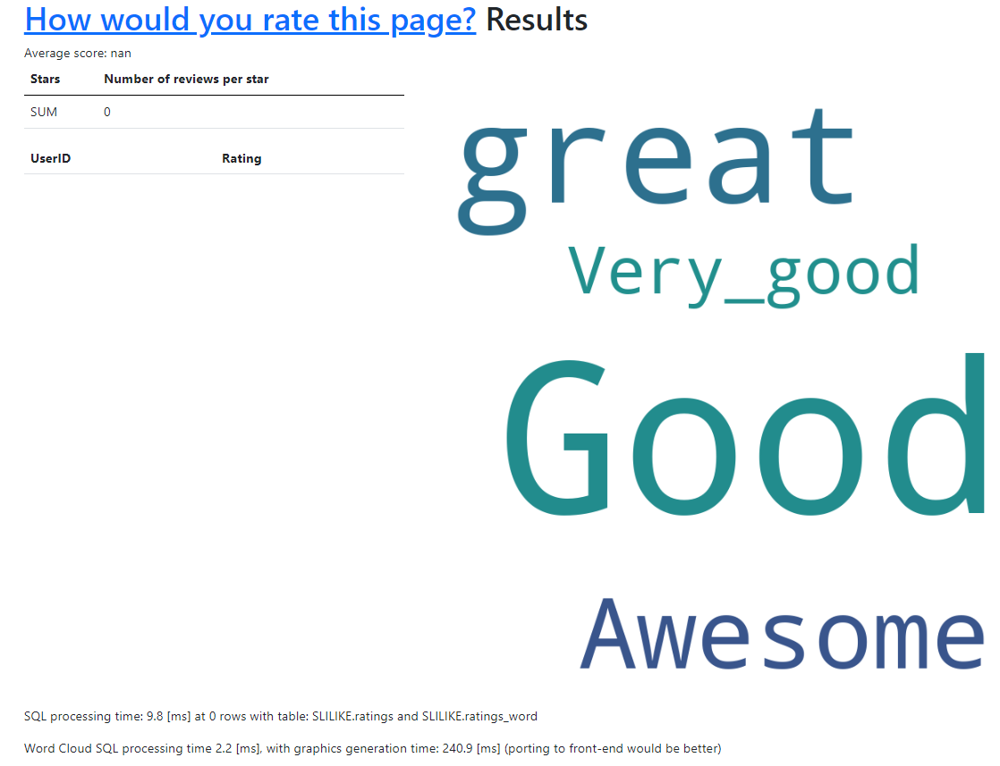
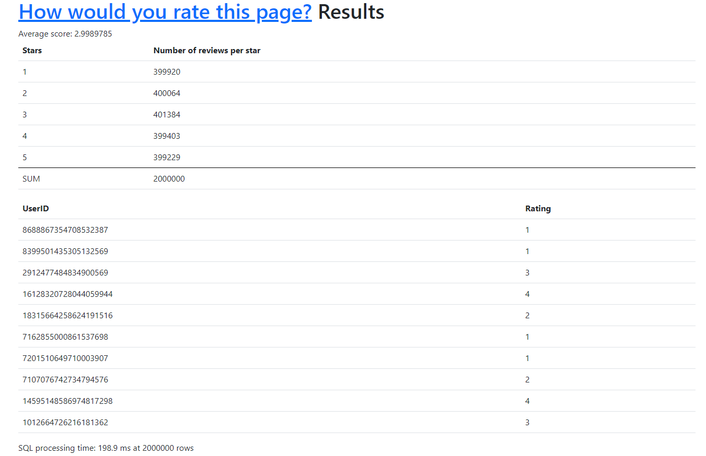

### SLike (Super Like)

Test of ClickHouse using `flask` + `mymarilyn/clickhouse-driver`. Fast setup thanks 
to `docker compose`. Integrated with `grafana` for simple data visualization.

### How to run:

- Install docker
- Run `docker-compose up` and enjoy

### Simple description
Flask application runs on 8080. `ClickHouse` uses default port configuration. This example is not exactly
what `ClickHouse` is truly good at (large quantities of immutable data) but it gets job done anyway
(for better representation what is `ClickHouse` good at, view word cloud below).
`ClickHouse` table is using `CollapsingMergeTree` so rows can be removed. This table engine is most 
suitable for this application (easy setup for data modification/deletion). In order to get most 
of the `ClickHouse`, table should be wider, data insertion rate lower and data should be inserted
in batches.

### Overview
#### Input
This is a simple input page for entering review and word to word cloud. Username is mandatory.
[(http://127.0.0.1:8080/)](http://127.0.0.1:8080/).

#### Output
This is a simple results page with some basic data preview. In V2 word cloud has been added!
Word cloud utilizes `MergeTree` table engine since no deletion is necessary, and it can perform
queries blazing fast!

#### Grafana integration

Also, Grafana with `grafana-clickhouse-datasource` (datasource plugin for `ClickHouse`) is included so 
feel free to tinker with it. This is a simple results page with some basic data preview 
using `Grafana` 
[(http://127.0.0.1:3000/)](http://127.0.0.1:3000/). Username: `admin`, password `admin`.

In order to connect `Grafana` with this `ClickHouse` instance, use these parameters for data 
source plugin (these can be modified in `docker-compose.yml`):

- Server address: `clickhouse_db`
- Server port: `9000`
- Username: `default`
- No password

### Simple testing
#### data generation
In order to fill database with some data, there are functions prepared in
`/simulation/inser_many_values.py` so feel free to insert as many data as your PC is able to handle.

#### data viewing
In order to test some simple queries, here is an example (calculate average rating):

`SELECT AVG(S_SUM) FROM
(SELECT SUM(rating * sign) AS S_SUM FROM SLILIKE.ratings GROUP BY userid HAVING SUM(sign) > 0)`

Application stores "ratings" for some random poll. These can be modified, each user can vote only
once (no login check, just type your nickname :) ). Results present average score, number of 
ratings for each category and first 10 ratings.

As mentioned previously, to populate database faster, there are some basic scripts prepared in
`/simulation/inser_many_values.py`.
These can be used to insert single data or data in batches. For example inserting 2,000,000 rows 
took 113125.5 [ms] = 113.1255 [s]. This also includes processing time.

Results page shows that SQL processing time is 194.3 ms at 2,000,000 rows. Previously mentioned 
query for calculating average rating takes around 25 [ms] on 100,000 rows and around 100 [ms] 
on 2,000,000 rows on my notebook. (Image from older version without word cloud)

These values can be improved by running `Distributed Table Engine`
on `ClickHouse` databases (multiple servers), in this case the bottleneck is network latency.