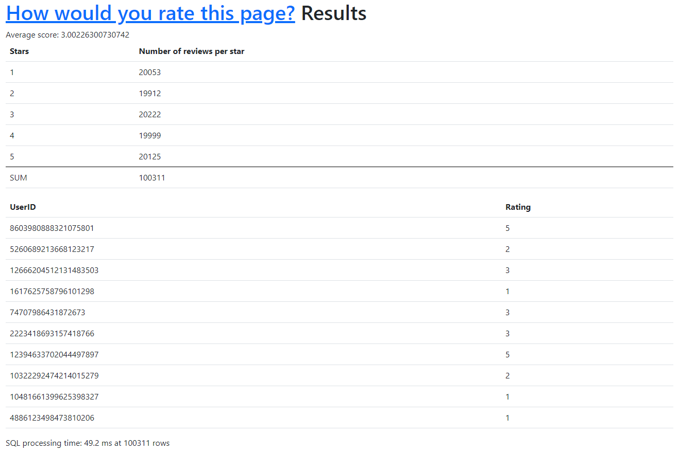
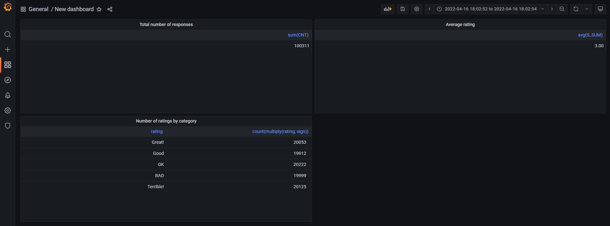

### SLike (Super Like)

Test of ClickHouse using `flask` + `mymarilyn/clickhouse-driver`. Fast setup thanks 
to `docker compose`. Integrated with `grafana` for simple data visualization.

### How to run:

- Install docker
- Run `docker-compose up` and enjoy

Flask application runs on 8080. ClickHouse uses default port configuration. This example is not 
what clickhouse is truly good at (large quantities of immutable data) but it gets job done anyway.
ClickHouse table is using `CollapsingMergeTree` so rows can be removed. This table engine is most 
suitable for this application (easy setup for data modification/deletion). In order to get most 
of the ClickHouse, table should be wider, data insertion rate lower and data should be inserted
in batches.

This is a simple input page for entering review 
[(http://127.0.0.1:8080/)](http://127.0.0.1:8080/).

This is a simple results page with some basic data preview 
[(http://127.0.0.1:8080/results)](http://127.0.0.1:8080/results).

Also Grafana with `grafana-clickhouse-datasource` (datasource plugin for ClickHouse) is included so 
feel free to tinker with it.
This is a simple results page with some basic data preview using `Grafana` 
[(http://127.0.0.1:3000/)](http://127.0.0.1:3000/). Username: `admin`, password `admin`.

In order to connect `Grafana` with this `ClickHouse` instance, use these parameters for data source plugin:

- Server address: `clickhouse_db`
- Server port: `9000`
- Username: `default`
- No password

In order to test some simple queries, here is an example (calculate average rating):

`SELECT AVG(S_SUM) FROM
(SELECT SUM(rating * sign) AS S_SUM FROM SLILIKE.ratings GROUP BY userid HAVING SUM(sign) > 0)`

Application stores "ratings" for some random poll. These can be modified, each user can vote only
once (no login check, just type your nickname :) ). Results present average score, number of 
ratings for each category and first 10 ratings. 
